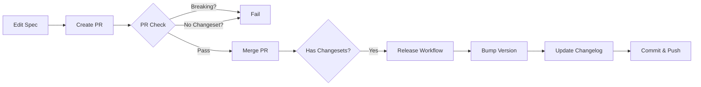

# Contractual Example: Petstore API

This repository demonstrates the full **Contractual** workflow for managing OpenAPI contract versioning, breaking change detection, and changelog generation.

## What is Contractual?

Contractual is a schema contract lifecycle orchestrator that helps you:
- **Detect breaking changes** in your OpenAPI/JSON Schema specs
- **Version your contracts** using semantic versioning
- **Generate changelogs** automatically
- **Enforce contract discipline** in pull requests

Think of it as [Changesets](https://github.com/changesets/changesets) for API contracts instead of npm packages.

---

## Quick Start

### 1. Clone and explore

```bash
git clone https://github.com/contractual-dev/example-openapi.git
cd example-openapi

# View the current contract
cat specs/petstore.openapi.yaml

# Check status
npx @contractual/cli@latest status
```

### 2. Make a change

Edit `specs/petstore.openapi.yaml` and add a new optional field:

```yaml
# In the Pet schema, add:
color:
  type: string
  description: Color of the pet (optional)
```

### 3. See the diff

```bash
npx @contractual/cli@latest diff
```

Output:
```
petstore: 1 change(s) (1 non-breaking) — suggested bump: minor

  non-breaking Property added at /components/schemas/Pet/properties/color
```

### 4. Create a changeset

```bash
npx @contractual/cli@latest changeset
```

This generates a changeset file in `.contractual/changesets/` with the detected changes.

### 5. Apply the version bump

```bash
npx @contractual/cli@latest version
```

This:
- Bumps the contract version (0.0.0 → 0.1.0)
- Updates `CHANGELOG.md`
- Creates a snapshot in `.contractual/snapshots/`
- Removes consumed changesets

---

## Workflow



### PR Check Workflow

When you open a PR with spec changes:

1. **Lint**: Validates OpenAPI syntax
2. **Breaking Check**: Detects breaking changes
3. **Changeset Check**: Ensures a changeset exists for spec changes
4. **Diff Summary**: Shows all detected changes

If breaking changes are detected or no changeset exists, the check fails.

### Release Workflow (Automated)

The release workflow uses the **Changesets pattern** with two phases:

#### **Phase 1: Version PR Creation**
When changesets are merged to `main`:

1. **Detect Changesets**: Checks if changesets exist in `.contractual/changesets/`
2. **Create Version PR**: Opens/updates a PR named "Version Contracts" that:
   - Runs `contractual version` to bump versions
   - Updates `CHANGELOG.md` with changes
   - Updates snapshots in `.contractual/snapshots/`
   - Removes consumed changesets
3. **PR Review**: Team reviews the version bumps before release

#### **Phase 2: Release Creation**
When the Version PR is merged to `main`:

1. **Detect Version Bump**: Checks if `versions.json` changed
2. **Create Git Tags**: Tags like `petstore@1.1.0` for each versioned contract
3. **Create GitHub Releases**: One release per contract with:
   - Changelog excerpt for that contract
   - Attached OpenAPI spec file from snapshots
   - Release notes with breaking change warnings
4. **Publish**: (Optional, Phase 3) Publish to package registries

---

## Breaking vs Non-Breaking Changes

### Breaking Changes (major bump)

These changes require a major version bump (1.0.0 → 2.0.0):

- **Remove an endpoint**: `DELETE /pets/{id}` removed
- **Remove a required field**: `name` field removed from `Pet`
- **Change field type**: `age` changed from `integer` to `string`
- **Add required field**: `ownerId` added as required to `Pet`
- **Remove enum value**: Remove `"bird"` from `species` enum
- **Tighten constraints**: Change `maxLength: 100` to `maxLength: 50` for existing field

### Non-Breaking Changes (minor bump)

These changes allow a minor version bump (1.0.0 → 1.1.0):

- **Add new endpoint**: `GET /pets/{id}/vaccinations`
- **Add optional field**: `color` added as optional to `Pet`
- **Add enum value**: Add `"hamster"` to `species` enum
- **Loosen constraints**: Change `minLength: 1` to `minLength: 0`

### Patch Changes (patch bump)

These changes allow a patch version bump (1.0.0 → 1.0.1):

- **Update descriptions**: Change field descriptions
- **Add examples**: Add example values
- **Fix typos**: Correct spelling errors

---

## Commands Reference

```bash
# Initialize Contractual in a repository
npx @contractual/cli init

# Show current contract versions and pending changesets
npx @contractual/cli status

# Lint all contracts
npx @contractual/cli lint

# Show all changes (breaking, non-breaking, patch)
npx @contractual/cli diff

# Check for breaking changes only
npx @contractual/cli breaking

# Create a changeset from detected changes
npx @contractual/cli changeset

# Apply version bumps and generate changelog
npx @contractual/cli version

# List contracts with versions
npx @contractual/cli contract list

# Add a new contract
npx @contractual/cli contract add
```

---

## Configuration

### `contractual.yaml`

```yaml
contracts:
  - name: petstore
    type: openapi
    path: specs/petstore.openapi.yaml

changeset:
  autoDetect: true       # Auto-detect breaking/non-breaking changes
  requireOnPR: true      # Require changeset for spec changes in PRs
```

### Directory Structure

```
.contractual/
├── changesets/              # Pending changesets (Markdown files)
│   └── brave-pandas-jump.md
├── snapshots/               # Versioned spec snapshots
│   └── petstore.yaml
└── versions.json            # Version registry
```

---

## Example Scenarios

### Scenario 1: Add a New Endpoint

```yaml
# Add to specs/petstore.openapi.yaml
/pets/{petId}/vaccinations:
  get:
    summary: Get pet vaccinations
    # ...
```

```bash
npx @contractual/cli diff
# Output: non-breaking, suggested bump: minor

npx @contractual/cli changeset
# Creates changeset file

npx @contractual/cli version
# Bumps: 1.0.0 → 1.1.0
```

### Scenario 2: Remove an Endpoint (Breaking)

```yaml
# Remove from specs/petstore.openapi.yaml
# /pets/{petId}:
#   delete:
#     ...
```

```bash
npx @contractual/cli breaking
# Output: Breaking change detected!

npx @contractual/cli changeset
# Creates changeset with major bump

npx @contractual/cli version
# Bumps: 1.1.0 → 2.0.0
```

### Scenario 3: Update Descriptions (Patch)

```yaml
# Change description in specs/petstore.openapi.yaml
name:
  type: string
  description: Name of the pet (updated description)
```

```bash
npx @contractual/cli diff
# Output: patch, suggested bump: patch

npx @contractual/cli changeset

npx @contractual/cli version
# Bumps: 2.0.0 → 2.0.1
```

---

## GitHub Actions Setup

The repository includes two workflows:

### `.github/workflows/pr-check.yml`

Runs on every pull request to:
- Lint the spec
- Detect breaking changes
- Ensure a changeset exists

### `.github/workflows/release.yml`

Runs when changesets are merged to `main` to:
- Consume changesets
- Bump versions
- Update changelog
- Commit changes back

---

## Learn More

- [Contractual Documentation](https://github.com/contractual-dev/contractual)
- [Installation](https://www.npmjs.com/package/@contractual/cli)
- [GitHub Action](https://github.com/contractual-dev/contractual/blob/main/docs/05-github-action-agent.md)

---

## License

MIT

